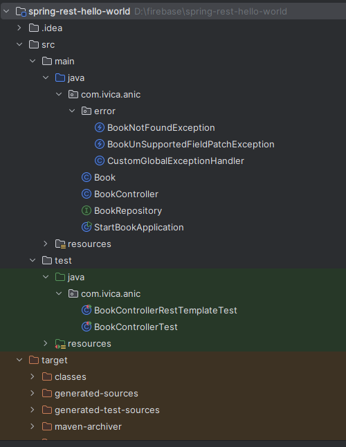
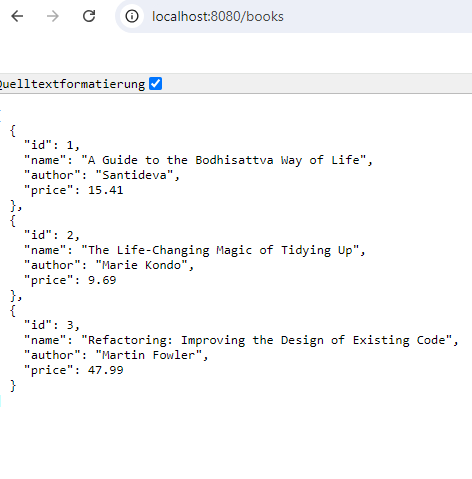

# Spring REST Hello World Example

Article link : Ivica_Anic_spring-boot-test_docu.pdf

## 1. How to start
```
$ git clone git@github.com:IvicaAnic/JAVA-Test-Projekten.git
$ cd spring-rest-hello-world
$ mvn spring-boot:run

$ curl -v localhost:8080/books
```
 <br>
 <br>
  <br>

